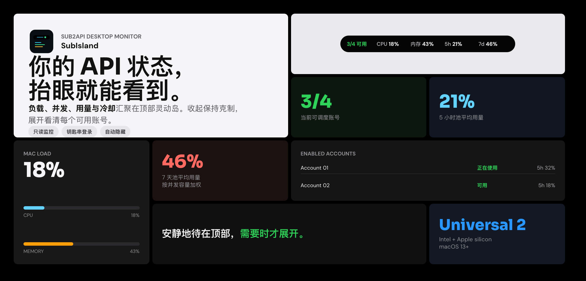
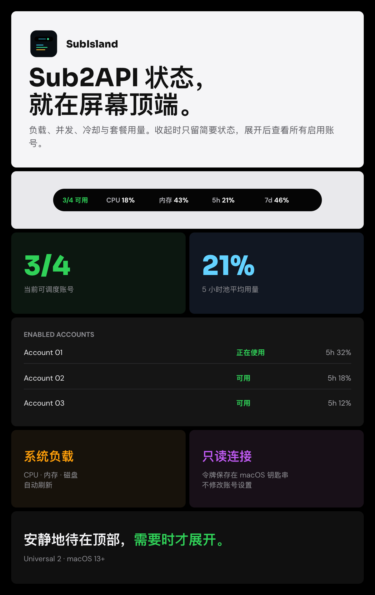

  

<h1 align="center">SubIsland</h1>

  把 Mac 负载与 Sub2API 状态放在屏幕顶端。 
  Mac load and Sub2API status, always visible at the top.

  
  
  

  <a href="https://github.com/DAWU210/SubIsland/releases/latest"><strong>下载最新版本 · Download Latest Release</strong></a>
  &nbsp;·&nbsp;
  <a href="#中文">中文</a>
  &nbsp;·&nbsp;
  <a href="#english">English</a>

---

## 中文

SubIsland 是一款轻量 macOS 顶部状态岛，用于集中查看 Mac 系统负载与 Sub2API 账号状态。

- 收起时显示账号可用数、CPU、内存、5 小时和 7 天用量
- 支持“简略 / 详细”两种显示模式
- 没有启用账号时自动收缩为 Mac-only 状态
- 展开后查看启用账号、并发、套餐用量、冷却和重置时间
- 只读连接，不修改 Sub2API 账号设置
- 登录令牌仅保存在当前 Mac 的系统钥匙串
- 全屏应用运行时自动隐藏

## English

SubIsland is a lightweight status island for monitoring Mac system load and Sub2API account availability in one place.

- Collapsed account availability, CPU, memory, 5-hour, and 7-day summaries
- Concise and detailed display modes
- Automatic Mac-only mode when no Sub2API accounts are enabled
- Expanded concurrency, quota usage, cooldown, and reset details
- Read-only Sub2API access that never changes account settings
- Login tokens stored only in the current Mac's system Keychain
- Automatic hiding while another app is full screen

## 界面预览 · Preview

  

## 下载 · Download

| 文件 · File | 用途 · Use |
| --- | --- |
| **DMG** | 推荐安装方式：打开后拖入 Applications · Recommended installer |
| **ZIP** | 便携应用压缩包 · Portable app archive |
| **SHA256SUMS.txt** | 下载完整性校验 · Download integrity checks |

  <a href="https://github.com/DAWU210/SubIsland/releases/latest"><strong>前往 Releases 下载 · Open Releases</strong></a>

**系统要求 · Requirements**

- macOS 13 or later
- Universal 2 for Intel and Apple silicon Macs

## 首次打开 · First Launch

> 当前安装包为 ad-hoc 签名。首次运行时，请在 Finder 中右键点击 `SubIsland.app`，选择“打开”。
>
> The current build is ad-hoc signed. On first launch, right-click `SubIsland.app` in Finder and choose **Open**.

## 隐私 · Privacy

本仓库仅分发安装包，不公开项目源码。发布包不包含账号、令牌、钥匙串、偏好设置、日志或本机路径。

This repository distributes release binaries only. Source code is not published. Release packages do not contain accounts, tokens, Keychain items, preferences, logs, or local machine paths.

Binary distribution only · All rights reserved

